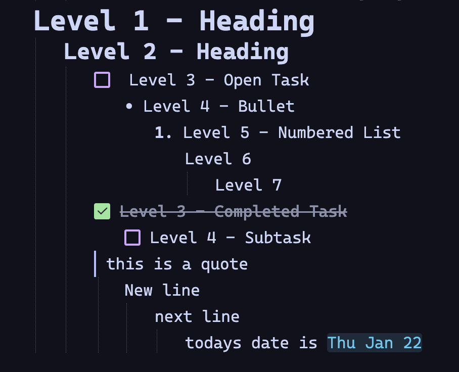
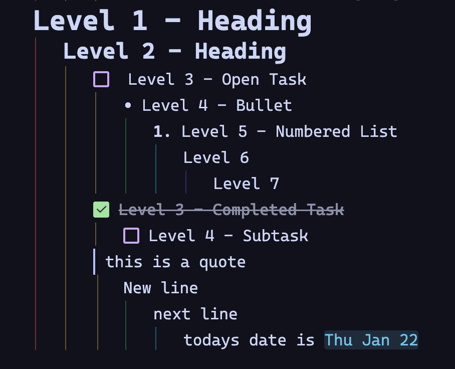

# Thymer Indent Rainbow

Rainbow-colored vertical indent guides for Thymer, inspired by popular IDE extensions like VS Code's `indent-rainbow`.

Each indentation level gets a unique color, making it much easier to track hierarchy and parent-child relationships at a glance.

## Screenshots

| Before | After |
|--------|-------|
|  |  |

## Features

- 🌈 **Rainbow Colors** - Each nesting level has a distinct, vibrant color
- 🎨 **6 Color Themes** - Rainbow, Ocean, Sunset, Forest, Neon, Monochrome
- 📏 **Configurable Width** - 1px, 2px, or 3px line thickness
- 🔆 **Adjustable Opacity** - Subtle, Normal, or Bold visibility
- 🎯 **Focus Highlighting** - Current line's guides glow when focused
- ⚡ **Toggle On/Off** - Quick enable/disable via Command Palette
- 💾 **Persistent Settings** - Your preferences are saved automatically

## Installation

1. Copy the `thymer-indent-rainbow` folder to your Thymer plugins directory
2. Reload Thymer
3. The plugin activates automatically with the Rainbow theme

## Usage

### Command Palette

Open the Command Palette and search for "Indent Rainbow":

| Command | Description |
|---------|-------------|
| `Indent Rainbow: Toggle On/Off` | Enable or disable the plugin |
| `Indent Rainbow: [Theme] Theme` | Switch color themes |
| `Indent Rainbow: Set Width - Npx` | Change line thickness |
| `Indent Rainbow: Opacity - [Level]` | Adjust visibility |

### Status Bar

Click the theme indicator in the status bar to quickly cycle through color themes.

## Color Themes

| Theme | Description |
|-------|-------------|
| **Rainbow** | Vibrant red → orange → yellow → green → blue → indigo → pink → purple |
| **Ocean** | Cool blues and cyans |
| **Sunset** | Warm reds, oranges, and pinks |
| **Forest** | Natural greens |
| **Neon** | High-contrast electric colors |
| **Monochrome** | Subtle grayscale |

## Requirements

- Thymer with Plugin SDK support

## License

MIT
